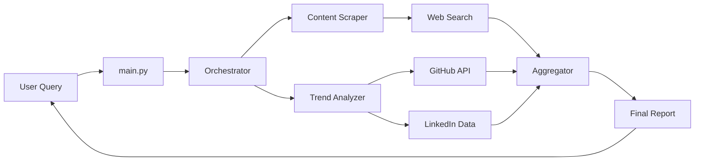

# GenAI Agents Project Structure

## Directory Organization

```
Case Study/
│
├── agents/                           # Core agents package
│   ├── __init__.py                   # Package initialization
│   ├── content_scraper_agent.py      # Content discovery agent
│   ├── trend_analysis_agent.py       # Trend analysis agent
│   └── orchestrator.py               # Main orchestrator
│
├── examples/                         # Example scripts and demos
│   ├── __init__.py                   # Package initialization
│   └── example_usage.py              # Comprehensive usage examples
│
├── docs/                             # Documentation
│   ├── genai_agents_architecture.md  # System architecture
│   └── PROJECT_STRUCTURE.md          # This file
│
├── archive/                          # Archived case study files
│   ├── evolveiq_review1_presentation.md
│   ├── EvolveIQ_Review1.pdf
│   ├── EvolveIQ_Review2.pdf
│   ├── EvolveIQ-Adaptive-Intelligence-for-the-Ever-Changing-Tech-Landscape.pdf
│   └── ext-Case study Guidelines.pdf
│
├── config.py                         # Configuration management
├── main.py                           # Main entry point
├── quick_start.py                    # Quick start script
├── requirements.txt                  # Python dependencies
├── .env.example                      # Environment template
├── .gitignore                        # Git ignore rules
└── README.md                         # Project documentation
```

## Module Descriptions

### agents/

**content_scraper_agent.py**
- Implements ContentScraperAgent class
- Searches web for GenAI learning resources
- Filters and categorizes content
- Calculates relevance scores
- Uses LangGraph for workflow orchestration

**trend_analysis_agent.py**
- Implements TrendAnalysisAgent class
- Fetches GitHub trending repositories
- Analyzes LinkedIn trending topics
- Aggregates trends from multiple sources
- Calculates engagement scores

**orchestrator.py**
- Implements GenAIAgentOrchestrator class
- Coordinates both agents
- Manages workflow state
- Generates comprehensive reports
- Provides AI-powered insights

**__init__.py**
- Package initialization
- Exports main classes
- Simplifies imports

### examples/

**example_usage.py**
- Five comprehensive examples
- Demonstrates all agent capabilities
- Shows different usage patterns
- Includes batch processing examples

### docs/

**genai_agents_architecture.md**
- System architecture overview
- Component descriptions
- Data flow diagrams
- Technology stack details

**PROJECT_STRUCTURE.md**
- This document
- Directory organization
- Module descriptions
- Design patterns

### Root Files

**config.py**
- Configuration management
- Environment variable loading
- API endpoints
- Default settings
- Validation functions

**main.py**
- Main entry point
- Command-line interface
- Simple query execution
- Report generation

**quick_start.py**
- Interactive quick start
- Environment validation
- Simple testing
- Interactive mode
- Example runner

**requirements.txt**
- Python package dependencies
- Version specifications
- Core libraries

**.env.example**
- Environment variable template
- API key placeholders
- Configuration examples

**.gitignore**
- Git ignore patterns
- Python artifacts
- Environment files
- Generated reports

**README.md**
- Project overview
- Installation instructions
- Usage examples
- API documentation

## Design Patterns

### Agent Pattern
Each agent is self-contained with:
- State management
- Workflow graph
- Tool definitions
- Node implementations

### Orchestration Pattern
Main orchestrator:
- Coordinates multiple agents
- Manages shared state
- Aggregates results
- Generates insights

### Configuration Pattern
Centralized configuration:
- Single source of truth
- Environment-based settings
- Validation at startup
- Easy customization

## Import Patterns

### Within Package
```python
from agents.orchestrator import GenAIAgentOrchestrator
from agents.content_scraper_agent import ContentScraperAgent
from agents.trend_analysis_agent import TrendAnalysisAgent
```

### Cross-Package
```python
from agents import GenAIAgentOrchestrator
import config
```

### Running Modules
```powershell
# Run main entry point
python main.py "query"

# Run quick start
python quick_start.py

# Run examples as module
python -m examples.example_usage
```

## Data Flow



## Extension Points

### Adding New Agents
1. Create new agent file in `agents/`
2. Implement LangGraph workflow
3. Add to `agents/__init__.py`
4. Update orchestrator to include new agent

### Adding New Data Sources
1. Create tool function with `@tool` decorator
2. Add to appropriate agent's tools list
3. Update agent workflow graph
4. Add configuration if needed

### Adding New Examples
1. Create function in `examples/example_usage.py`
2. Add to `run_all_examples()` menu
3. Update README with new example

## Testing Strategy

### Manual Testing
- Use `quick_start.py` for interactive testing
- Run examples with `python -m examples.example_usage`
- Test individual agents directly

### Environment Testing
- Validate API keys
- Check dependencies
- Verify configuration

## Future Structure

Planned additions:
```
tests/                    # Unit and integration tests
├── test_content_scraper.py
├── test_trend_analyzer.py
└── test_orchestrator.py

utils/                    # Utility functions
├── cache.py             # Caching layer
└── logging.py           # Logging utilities

api/                      # API endpoints (future)
└── rest_api.py          # REST API server

ui/                       # Web interface (future)
└── dashboard.py         # Web dashboard
```

