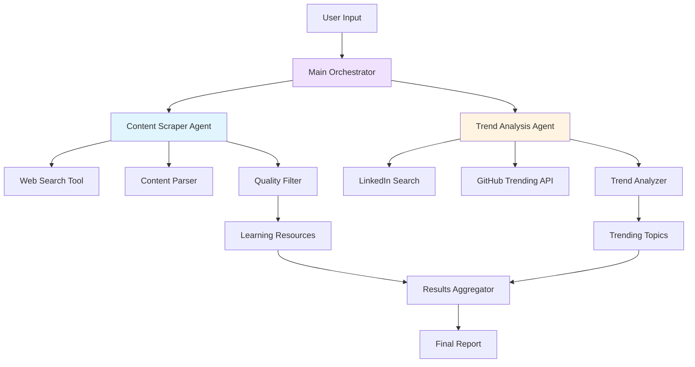

# GenAI Learning & Trend Analysis Agents Architecture

## System Overview

A multi-agent system built with LangGraph for discovering GenAI learning content and analyzing trending topics across professional platforms.

## Architecture Diagram

## Component Architecture

### 1. Content Scraper Agent
- Purpose: Discover and curate GenAI learning resources
- Capabilities:
  - Search multiple sources (blogs, tutorials, courses, documentation)
  - Extract relevant content metadata (title, URL, description, date)
  - Filter by quality indicators
  - Categorize content types (tutorial, course, article, video)

### 2. Trend Analysis Agent
- Purpose: Identify trending GenAI topics across professional platforms
- Capabilities:
  - Query GitHub trending repositories
  - Search LinkedIn posts and hashtags
  - Analyze engagement metrics
  - Rank topics by popularity

### 3. Main Orchestrator
- Coordinates both agents
- Manages state flow
- Aggregates results
- Generates final reports

## Technology Stack
- LangGraph: Agent workflow orchestration
- LangChain: LLM interactions and tool integration
- BeautifulSoup4: HTML parsing
- Requests: HTTP operations
- Python-dotenv: Environment configuration

## Data Flow

1. User provides search query or topic
2. Orchestrator initiates both agents in parallel
3. Content Scraper Agent:
   - Performs web searches for learning content
   - Parses and filters results
   - Returns structured learning resources
4. Trend Analysis Agent:
   - Queries GitHub and LinkedIn APIs
   - Analyzes trending topics
   - Returns ranked trends
5. Aggregator combines results
6. System outputs comprehensive report

## Configuration Requirements
- OpenAI API Key or other LLM provider
- Optional: GitHub API token for higher rate limits
- Optional: LinkedIn API credentials

## Output Format

Results include:
- Learning resources with metadata
- Trending topics with engagement metrics
- Relevance scores
- Timestamps and sources

